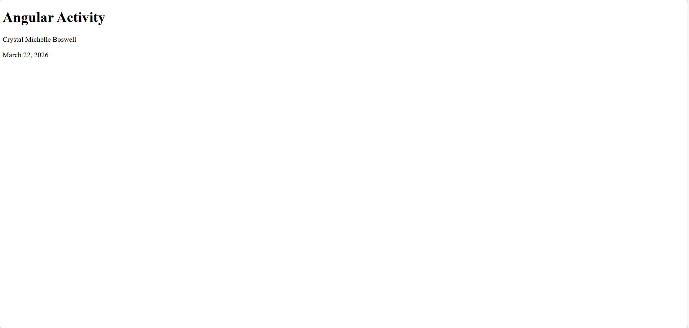

# 🚀 Angular Activity Project

This is a simple Angular application created using Angular CLI.

## 📌 Project Description
This project displays:
- Activity title
- Student name
- Current date

## 🛠️ Technologies Used
- Angular
- TypeScript
- HTML
- CSS

## ▶️ How to Run the Project

1. Navigate to project folder:
   ```
   cd angular-app
   ```
2. Install dependencies:
   ```
   npm install
   ```
3. Run the app:
   ```
   ng serve --open
   ```

## 📷 Screenshot



## 👤 Author
Crystal Michelle Boswell